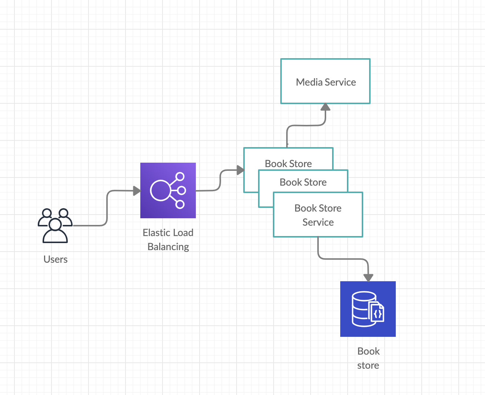
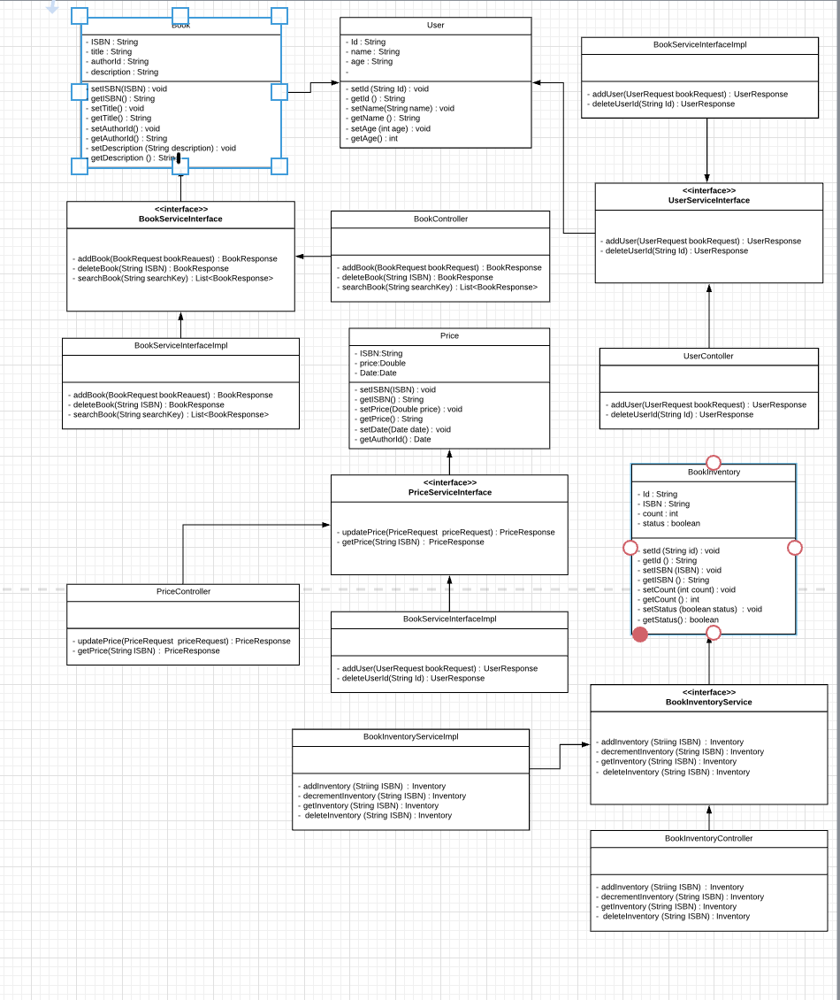

Book store service Design
   
    1.Objective
        1.1: Goals and Non-goals
    2. Assumptions
    3. Design and Architectural view
        3.1: High level architecture
        3.2: Technologies
    4.Database design
        4.1:Data model
    5.Server design
        5.1: API’s
        5.2: Class diagram
    6. Performance,Scale and reliability
    7. Monitoring and alerting
---------------------------------------------------------------------------------------------------------------------------
Objective:
    
    To offer users the ability to maintain an online book store and enable the users to buy books from online store.
        
    Goals: 
        - Admin can add books to the store.
        - Admin can remove book from store
        - Admin can mark the book not available.
        - Admin can add inventory to the book.
        - Admin can add the price of the book.
        - Users can search books in the store by giving the text.
            - System should be capable of returning a search result if the text matches ISBN, Title and Author name.
        - Users should be able to search media posts about the book by providing the ISBN.
        - System should provide all the media posts which match partially with the book title.
        - Users can buy a book from a store.
    Non-goals:
        - Managing user data.
        - Authentication of users.
        - Authorization of user actions
Assumptions:

    - Media search api is highly available
    - Price of book changes based only date.

Design and Architectural view:

    High level design:
   

    Components:
    
    Book Store service:
        It exposes a set of apis to implement the use cases listed as part of goals.
    Media Service:
        This is an external service which exposes media api to search the media coverage of the books.
    Elastic load balancer:
        Balances the load across multiple copies of the book store.
    Book store:
        Database to store the book related data.

Technologies:
    
    Tools:
        - Intellij IDE
        - Mongo Compass
    Technologies:
        - Language: Java
        - Framework: SpringBoot
        - Database: MongoDB
        - Operating System: MacOS
    
Server Design

    Class diagram:
   
    
    API’s:
        
        Add Book : 
            - This service is used to add the book.
            - What does this service do ?
                - Check whether the book is already present or not.
                - If it is not present then create the book		       
                    - POST method :			 	
                    -  Request URL : <Bookstore DNS>/api/book				
                    -  Request contains following information					
                        - ISBN					
                        - Title				
                        - Author					
                        - Description           
                -  Response contains following information          
                        - ISBN        
                        - Title
                        - author           
                        - description
        
        Delete Book : 
            - This service is used to delete the book
            - What does this service do ?
                    - Check whether the book is already present or not.
                    - If it is present then deletes it.
                        - DELETE method :
                        - Request URL : <Bookstore DNS>/api/book/remove 
                        - Request contains following information
                            - ISBN
                        - Response contains following information
                            - ISBN
                            - Title
                            - author
                            - description
        Search Book :
            - This service is used to search the books based on given text.
            - What does this service do ?
                    - This service searches all the books which are having partial   or full match with the given text compared to Title / Author / ISBN
                        - GET method : 
                        - Request URL : <Bookstore DNS>/api/book
                        - Request contains following information 
                            - search key (it is text which is in string format)
                        - List of Responses contains following information
                            - ISBN
                            - Title
                            - author
                            - description
        Add User : 
            - This service is used to add the user.
            - What does this service do ?
                    - Checks whether the user is already present or not.
                    - If user is not present then it adds user
                        - POST method : 
                        - Request URL : <Bookstore DNS>/api/user
                        - Request contains following information
                            - Id
                            - name
                            - age
                            - mobile number
                            - email id
                        - Response contains following information
                            - Id
                            - name
                            - age
                            - mobile number
                            - email id
        Delete User :
            - This service is used to delete the user.
            - What does this service do ?
                    - Checks whether the user is present or not.
                    - If a user is present then it deletes the user.
                        - DELETE method :
                        - Request URL : <Bookstore DNS>/api/user/remove
                        - Request contains following information
                            - Id of user to be deleted
                        - Response contains following information
                            - Id
                            - name
                            - age
                            - mobile number
                            - email id
        Add Inventory :
            - This service is used to increment the inventory for a book.
            - What does this service do ?
                    - Checks whether the book inventory is present or not.
                    - If it is present then increments the count of books available
                    - If not then book inventory is created with one count.
                        - POST method :
                        - Request URL : <Bookstore DNS>/api/inventory/addInventiry
                        - Request contains following information 
                            - ISBN 
                        - Response contains the following information
                            - Id
                            - ISBN 
                            - count 
                            - status
        Decrement Inventory : 
            - This service is used to decrement the inventory count of a book.
            - What does this service do ?
                    - Checks whether the book inventory is present or not.
                    - If it is present then decrements the count of books available
                    - If not then report an error.
                        - POST method : 
                        - Request URL : <Bookstore DNS>/api/inventory/deleteInventory
                        - Request contains following information 
                            - ISBN 
                        - Response contains the following information
                            - Id
                            - ISBN 
                            - count 
                            - status
        Get Inventory :
            - This service is used to get the inventory details of the book.
            - What does this service do ?
                    - Checks whether the book inventory is present or not
                    - If it is present then it returns inventory details of book 
                    - If not then it reports an error 
                        - GET method :
                        - Request URL : <Bookstore DNS>/api/inventory/getInventory
                        - Request contains following information
                            - ISBN
                    - Response contains following information
                            - Id
                            - ISBN 
                            - count  
                            - status
        Delete Inventory :
            - This service is used to make book un available in inventory
            - What does this service do ?
                    - Checks whether the book inventory is present or not
                    - If it is present then it changes status of book available to Unavailable
                    - If not then it reports an error.
                        - DELETE method
                        - Request URL : <Bookstore DNS>/api/inventory/deleteInventory
                        - Request contains following information
                            - ISBN
                        - Response contains following information
                            - Id
                            - ISBN
                            - count
                            - status
        Book Ordering :
            - This service is used to order the book from store
            - What does this service do ?
                   - Checks whether the book inventory is present or not
                   - If it is available then it places the order of book
                   - If not it reports an error 
                        - GET method :
                            - Request URL : <Bookstore DNS>/api/ordering
                            - Request contains following information
                                - ISBN
                            - Response contains following information
                                - ISBN 
                                - Title
                                - Author
                                - Description
                                - Order status
        Update Price :
            - This service is used to update the price of a book
            - What does this service do ?
                    - It updates the price of a book
                        - POST method :
                        - Request URL : <Bookstore DNS>/price/api
                        - Request contains the following information
                                - ISBN
                                - Price
                                - Date
                        - Response contains the following information
                                - ISBN
                                - Price
                                - Date
        Get Price :
            - This service is used to get the price details of a book
            - What does this service do ?
                    - Checks whether book is available or not
                    - If it is available then it returns a price information of a book
                    - If not it reports an error
                        - GET method :
                        - Request URL : <Bookstore DNS>/price/api
                        - Request contains the following information
                                - ISBN
                        - Response contains the following information
                                - ISBN
                                - Price
                                - Date
        Buy Book :
            - This service is used to buy the book from store
            - What does this servide do ?
                    - Checks whether book is available or not in inventory
                    - If it is avaialable then returns book
                    - If it is not available then reports an error
                        - GET method :
                        - Request URL : <Bookstore DNS>/api/ordering
                        - Request contains following information
                                - ISBN
                        - Response contains following information
                                - ISBN
                                - Title
                                - Author
                                - Description
                                - Status
        Get Media Posts :
            - This service is used to find the posts in media about the book
            - What does this service do ?
                    - Get the all media posts from media client.
                    - Created inverted index for each word in all media posts.
                    - Based on given search key it return all the posts using inverted index if any parital or full match.
                        - GET method :
                        - Request URL : <Bookstore DNS>/api/media
                        - Request contains following information
                                - ISBN
                        - Response contains following information
                                - User Id
                                - Id 
                                - Title
                                - Body
    
        
                
    
    
                    
    
    
                                   
    
            
