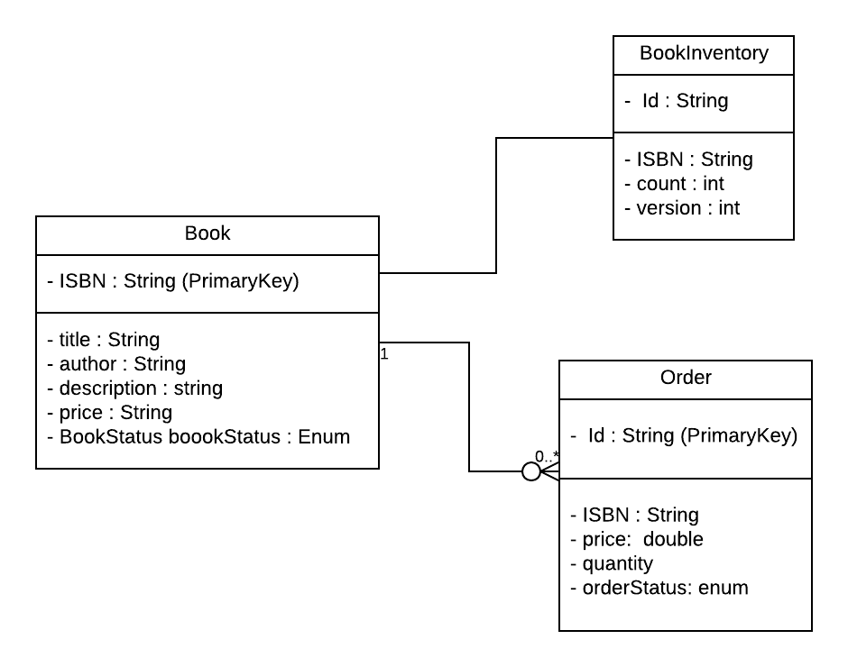

Deployment instructions:
    
    - Clone the repository:
        - $git clone git@github.com:syamprasaddannuri/BookOnlineStore.git
    - Install docker
        - Please find the instructions here: https://docs.docker.com/get-docker/
    - Build docker image :
        - Move to the to source repository in terminal
        - Run the following commands
            - $docker build -t springio/gs-spring-boot-docker .
            - $docker run -p 8080:8080 springio/gs-spring-boot-docker
        - After completing the above steps service get's deployed in docker(if installed) and accessble at 8080 port.
        
Book store service Design
   
    1.Objective
        1.1: Goals and Non-goals
    2. Assumptions
    3. Design and Architectural view
        3.1: High level architecture
        3.2: Technologies
    4. Data Model
    5. Server design
            5.1: Class diagram
            5.2: API's
---------------------------------------------------------------------------------------------------------------------------
Objective:
    
    To offer users the ability to maintain an online book store and enable the users to buy books from online store.
        
    Goals: 
        - Admin can add books to the store.
        - Admin can remove book from store
        - Admin can mark the book not available.
        - Admin can add inventory to the book.
        - Admin can add the price of the book.
        - Users can search books in the store by giving the text.
            - System should be capable of returning a search result if the text matches ISBN, Title and Author name.
        - Users should be able to search media posts about the book by providing the ISBN.
        - System should provide all the media posts which match partially with the book title.
        - Users can buy a book from a store.
    Non-goals:
        - Managing user data.
        - Authentication of users.
        - Authorization of user actions
Assumptions:

    - Media search api is highly available

Design and Architectural view:

    High level design:
   

    Components:
    
    Book Store service:
        It exposes a set of apis to implement the use cases listed as part of goals.
    Media Service:
        This is an external service which exposes media api to search the media coverage of the books.
    Elastic load balancer:
        Balances the load across multiple copies of the book store.
    Book store:
        Database to store the book related data.

Technologies:
    
    Tools:
        - Intellij IDE
        - Mongo Compass
    Technologies:
        - Language: Java
        - Framework: SpringBoot
        - Database: MongoDB
        - Operating System: MacOS
        
Data Model:
 
    
Server Design

    Class diagram:
   
    
    API’s:
        
        Add Book : 
            - This service is used to add the book.
            - What does this service do ?
                - Check whether the book is already present or not.
                - If it is not present then create the book		       
                    - POST method :			 	
                    -  Request URL : <Bookstore DNS>/api/book				
                    -  Request contains following information					
                        - ISBN					
                        - title				
                        - author
                        - price					
                        - description         
                -  Response contains following information
                        - ISBN					
                        - title				
                        - author
                        - price					
                        - description
                        - status  
        Delete Book : 
            - This service is used to delete the book
            - What does this service do ?
                    - Check whether the book is already present or not.
                    - If it is present then deletes it.
                    - If it is not present then reports an error
                        - DELETE method :
                        - Request URL : <Bookstore DNS>/api/book/remove 
                        - Request contains following information
                            - ISBN
        Search Book :
            - This service is used to search the books based on given text.
            - What does this service do ?
                    - This service searches all the books which are having partial or full match with the given text compared to Title / Author / ISBN
                        - GET method : 
                        - Request URL : <Bookstore DNS>/api/book
                        - Request contains following information 
                            - search key (it is text which is in string format)
                            - pageNo
                            - pageSize
                        - Response contains following information
                            - List of Books
                            - count
                            - Information about number of pages and each page size
        
        Update Inventory : 
             - This service is used to update the book inventory
             - what does this service do ?
                    - Checks whether the book inventory is present or not
                    - If it is not present then cretaes inventory
                    - if it is present the upodates the invenrtory
                            - POST method :
                            - Request URL : <Bookstore DNS>/api/inventory
                            - Request contains following information
                                - ISBN					
                                - title				
                                - author
                                - price					
                                - description
                                - status  
        
        Get Inventory :
            - This service is used to get the inventory details of the book.
            - What does this service do ?
                    - Checks whether the book inventory is present or not
                    - If it is present then it returns inventory details of book 
                    - If not then it reports an error 
                        - GET method :
                        - Request URL : <Bookstore DNS>/api/inventory
                        - Request contains following information
                            - ISBN
                    - Response contains following information
                            - ISBN 
                            - count
        Book Ordering :
            - This service is used to order the book from store
            - What does this service do ?
                   - Checks whether book is available or not
                   - if it is not available then retports an error
                   - if it is available then following steps performed
                   - Checks whether the book inventory is present or not
                   - If it is available then it places the order of book
                   - If not it reports an error 
                        - GET method :
                            - Request URL : <Bookstore DNS>/api/ordering
                            - Request contains following information
                                - ISBN
                                - quantity
                            - Response contains following information
                                - ISBN 
                                - Title
                                - Author
                                - Description
                                - quantity
                                - orderstatus
        Get Media Posts :
            - This service is used to find the posts in media about the book
            - What does this service do ?
                    - It searches posts in map that has been created using scheduling.
                    - All the matched posts has been returned
                        - GET method :
                        - Request URL : <Bookstore DNS>/api/media
                        - Request contains following information
                                - ISBN
                        - Each Response from Media Posts contains following information
                                - authorId
                                - postId
                                - Title
                                - content
                                  
    
        
                
    
    
                    
    
    
                                   
    
            
